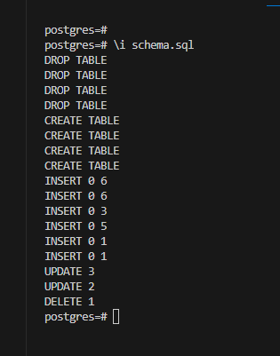
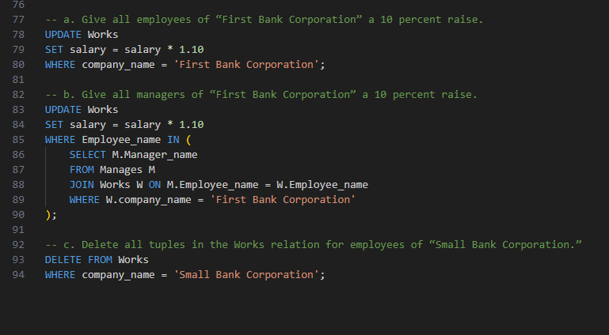

# DSC_E3.17

Figure 3.20: 
Employee Database Schema
Employee (Employee-name, street, city)
Works (Employee-name, company-name, salary)
Company (Company-name, city)
Manages (Employee-name, Manager-name)

Consider the relational database of Figure 3.20. Give an expression in SQL for each of the following queries:

a. Give all employees of "First Bank Corporation" a 10 percent raise.
b. Give all managers of "First Bank Corporation" a 10 percent raise.
c. Delete all tuples in the works relation for employees of "Small Bank Corporation."

